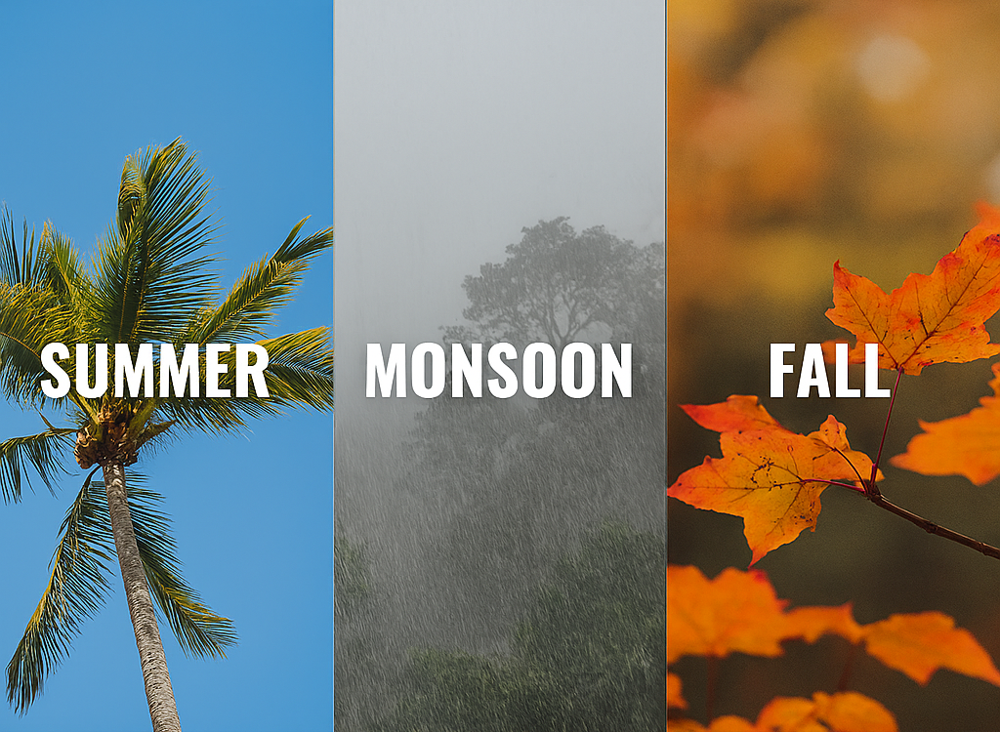

# Midterm Project Debate: Summer vs Monsoon vs Fall - The Weather Challenge

This is a team-based debate project where each member defends their chosen season—summer, monsoon, or fall—as the best. Through discussion, we’ll explore what makes each season uniquely wonderful.

## Installation 💻
No installation required, simply download the zip file and extract.
## Usage
Open index.html in your choice browser and watch our debate.

## Contributing 
1. Fork it!
2. Create your feature branch: `git checkout -b my-new-feature`
3. Commit your changes: `git commit -am 'Add some feature'`
4. Push to the branch: `git push origin my-new-feature`
5. Submit a pull request :D

## History
TODO: Write history
## Credits
Hee Jin Cheon, Hars & Jake
## License
MIT License.

